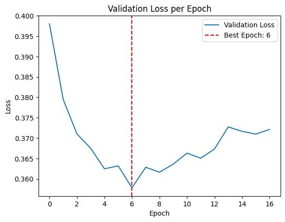

        <h1>Medical Image Segmentation</h1>
            
This problem is tackled using a U-Net architecture

            

            
            <a href="">
                
            
	        

## Description
This project was developed for a [Kaggle competition](https://www.kaggle.com/competitions/2425-ii-ait-3002-medical-image-segmentation) on medical image segmentation. It uses a U-Net model implemented in [model.py](model.py), with custom loss functions in [loss.py](loss.py) and a data pipeline defined in [dataset.py](dataset.py). The training process is handled in [train.py](train.py), and [main.py](main.py) serves as the entry point for training and testing. Detail trainning can be found in [image-processing.ipynb](image-processing.ipynb). Additionally, I replaced the encoder of the U-Net model with a ResNet to enhance feature extraction. This modification is implemented in [image-processing.ipynb](image-processing.ipynb).

## Data
The dataset is divided into Train and Test sets.
- The Train set contains two folders:

    - Image/: 1087 grayscale medical images

    - Mask/: corresponding segmentation masks for each image

- The Test set includes 192 images in the Image/ folder. The masks are hidden and used for testing on Kaggle when submitting
## Hyperparameters
- Batch size = 16
- Optimizer: Adam with initial learning rate is 0.0001
- Loss function: The loss function combines BCELoss and Dice Loss, with a weighting factor of 0.5 assigned to each
- A learning rate scheduler is used, which reduces the learning rate by a factor of 0.5 if the validation loss does not improve for 3 consecutive epochs
- Early stopping is applied to halt training if the validation loss does not improve for 10 consecutive epochs
## Result
- Best validation loss is approximately 0.367 which achieved at epoch 23 when using original U-net model

- Best validation loss is approximately 0.35 which achieved at epoch 6 when using Unet with Resnet encoder

- The Kaggle submission score with the original U-Net model was 0.8658 / 1
- The Kaggle submission score with the U-Net model using a ResNet encoder was 0.93 / 1
